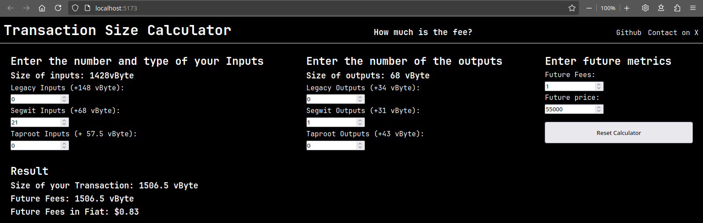

# Transaction Size Calculator 

Minimal Calculator to get the size of your transaction. Use for planing your UTXO-size in Cold Storage

## Use in docker

A dockerfile is provided in the repo. Clone the repo to your local machine, build your image and run the calculator inside a container.
